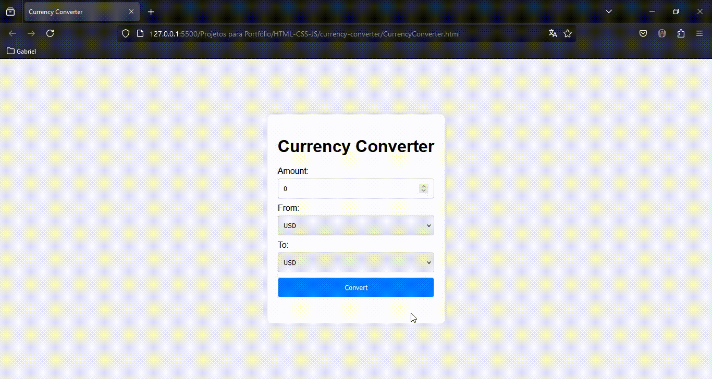

# Currency Converter

## Overview
The Currency Converter is a simple, user-friendly web application designed to help users convert amounts from one currency to another in real-time. This project leverages the ExchangeRate-API to fetch the latest conversion rates and provides an intuitive interface for ease of use.

## Features
- **Real-time Currency Conversion:** Get the latest conversion rates using the ExchangeRate-API.
- **User-friendly Interface:** A clean and simple design for an intuitive user experience.
- **Dynamic Currency Options:** Automatically populates currency options from the API.

## Technologies Used
- **HTML:** For structuring the web page.
- **CSS:** For styling the application.
- **JavaScript:** For handling the logic and API requests.
- **ExchangeRate-API:** For fetching real-time currency conversion rates.

## Project Structure
- **index.html:** The main HTML file containing the structure of the application.
- **css/styles.css:** The CSS file for styling the application.
- **js/script.js:** The JavaScript file containing the logic for fetching conversion rates and updating the UI.

## API Key
The application uses the ExchangeRate-API for fetching conversion rates. Make sure to replace the API key in `js/script.js` with your own if you are planning to deploy or modify the project.

```javascript
const apiKey = 'your_api_key_here'; // Replace with your ExchangeRate-API key

##


